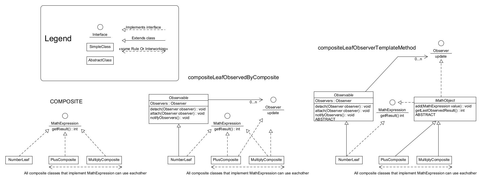

# Description:

- `composite`A simple composite pattern.
- 
- `is.hi.hbv202g.ass9.compositeLeafObservedByComposite`:an implementation of the composite pattern that is combined with the observable patterns.
- `is.hi.hbv202g.ass9.compositeLeafObserverTemplateMethod`:a refactoring of the above patterns inspired by the template method pattern.

Diagram :The followed packages are followed in the diagram:
